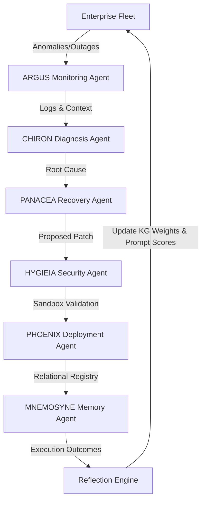

# ASCLEPIUS

### *The Autonomous Healing System for Enterprise AI Agents.*

---

## Executive Summary

**ASCLEPIUS** is an autonomous operating system designed to monitor, diagnose, validate, deploy, and evolve enterprise AI agents. Operating as next-generation AIOps/SRE for large language model agents, it manages the complete lifecycle of agent operational failures (e.g., hallucinations, prompt drift, API timeouts, and tool outages). Instead of retraining the underlying model, ASCLEPIUS resolves issues dynamically and optimizes future behavior via persistent memory, strategy versioning, and knowledge graphs.

---

## The Enterprise Problem

Organizations are deploying hundreds of autonomous agents (e.g., Support, Coding, HR, Finance). Over time, these agents degrade due to:
* **LLM Hallucinations & Prompt Drift**
* **External API & Tool failures (MCP server outages)**
* **Package/Dependency conflicts**
* **Security vulnerability exposures**

Today, site reliability engineers manually diagnose and patch these agents. **ASCLEPIUS** automates the entire loop: **Observe → Detect → Diagnose → Repair → Validate → Deploy → Learn**.

---

## Key Innovations

1. **Autonomous Healing**: Continuous monitoring and automated deployment of patch scripts or prompt modifications inside sandboxed environments.
2. **Enterprise Memory**: A NetworkX directed graph persistent store that maps failures to successful strategies, creating an immutable timeline of organization learning.
3. **Reflection Engine**: Post-healing analysis (`reflect_on_recovery`) that grades recovery success, updates strategy confidence weights, and updates the knowledge graph.
4. **Zero-Model Retraining**: Evolution happens at the system level (graph pathways, prompt versions, and response strategies) rather than computationally expensive fine-tuning.

---

## Architecture Overview

ASCLEPIUS is built on a clean split:
* **Backend**: FastAPI + SQLite for relational audit records, combined with a NetworkX knowledge graph mapping incident resolutions.
* **Frontend**: A high-density Mission Control center powered by React + TypeScript, React Flow (interactive force-directed network graph), and TailwindCSS (v4).

### Multi-Agent Orchestration Loop



---

## Tech Stack

* **Backend**: Python 3.10+, FastAPI, SQLAlchemy (SQLite), NetworkX, Pydantic (v2)
* **Frontend**: React, TypeScript, TailwindCSS (v4), React Flow, Lucide Icons, Vite
* **Package Management**: Pip, Npm

---

## Project Structure

```
asclepius/
├── backend/
│   ├── agents/            # Google ADK agent orchestration classes
│   ├── api/               # FastAPI setup and routers
│   ├── core/              # Global config and logging modules
│   ├── database/          # SQLite models and connection setup
│   ├── knowledge_graph/   # NetworkX Graph file management
│   ├── memory/            # JSON Memory to Python Object parsers
│   ├── orchestration/     # Agent state machine transitions
│   ├── reflection/        # Post-healing cognitive reflections
│   └── simulation/        # Synthetic fault injection engine
├── frontend/
│   ├── src/
│   │   ├── components/    # TopNav, Panels, Graph, Drawer
│   │   ├── context/       # Live API polling & simulation state context
│   │   └── index.css      # Custom styles & Tailwind imports
│   └── vite.config.ts     # Proxy routes to backend
└── .gitignore
```

---

## Installation & Running

### 1. Prerequisites
Ensure you have Python 3.10+ and Node.js installed on your system.

### 2. Running the Backend
```bash
cd backend
pip install -r requirements.txt
uvicorn api.main:app --reload
```
*The database `asclepius.db` and the graph `knowledge_graph.json` will be initialized in the backend directory on start.*

### 3. Running the Frontend
In a new terminal:
```bash
cd frontend
npm install
npm run dev
```
Open `http://localhost:5173` to access the Mission Control dashboard.

---

## API Documentation Overview

* `GET /api/v1/agents`: Lists all monitored enterprise agent nodes.
* `GET /api/v1/incidents`: Historical timeline of agent failures and states.
* `GET /api/v1/metrics`: Dynamic operational efficiency, DB size, and reflection stats.
* `GET /api/v1/knowledge`: Returns NetworkX-compatible node/link schema.
* `POST /api/v1/simulation/run`: Injects a failure vector on a specific agent to run the healing workflow.

---

## Demo Walkthrough

1. Go to the dashboard and open the **[ CMD PALETTE ]** injector.
2. Select **Coding Agent** and choose **LLM Hallucination (Prompt Drift)**.
3. Hit **INJECT FAILURE**.
4. Observe the center canvas react: the target node turns Red/Amber, the left log tracks the SOC detection, the right sidebar highlights the active agent (Argus → Chiron → Panacea → Hygieia → Phoenix → Mnemosyne), and the reflection panel updates with lessons learned.
5. Watch the node enter a blue "Learning" phase before settling back to Green "Healthy" with an updated memory score.

---

## License
MIT License.
