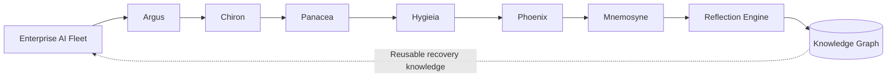

# 🛡️ ASCLEPIUS

## The Autonomous Immune System for Enterprise AI Agents

*"What if AI agents could heal themselves instead of waiting for engineers?"*

---


---

## The Problem

Enterprises are rapidly deploying AI agents across customer support, software development, HR, finance, procurement, and many other business functions. While these agents automate work and improve productivity, they inevitably become less reliable over time. Hallucinations, prompt drift, API changes, tool failures, dependency conflicts, and security issues can all degrade their performance.

Today, recovering from these failures is largely a manual process. Engineers must investigate logs, identify the root cause, decide on a recovery strategy, validate the fix, deploy it safely, and document what happened for future reference.

As organizations grow from managing a handful of AI agents to hundreds, this operational burden scales rapidly. The challenge is no longer building AI agents—it's keeping them reliable, secure, and resilient throughout their lifecycle.
---

# Our Solution

ASCLEPIUS approaches enterprise AI reliability the way the human immune system protects the body. Instead of waiting for engineers to notice and repair failures, it continuously monitors AI agents, detects abnormal behavior, investigates the root cause, generates a recovery strategy, validates the proposed solution, and safely restores the affected agent.

What makes ASCLEPIUS different is that every recovery becomes organizational knowledge. Successful strategies are recorded in a persistent knowledge graph, allowing similar incidents to be resolved more efficiently in the future. Rather than retraining the underlying language model, ASCLEPIUS improves the operational system around it—continuously evolving its recovery strategies, decision-making process, and organizational memory with every incident it handles.

---

# Tech Stack

### Backend

- Python
- FastAPI
- SQLite
- SQLAlchemy
- NetworkX
- Pydantic

### Frontend

- React
- TypeScript
- Tailwind CSS
- React Flow
- Vite

---

# How ASCLEPIUS Works

Unlike traditional monitoring systems that only report failures, ASCLEPIUS manages the complete recovery lifecycle autonomously. Each stage is handled by a specialized agent, and every successful recovery is recorded in a knowledge graph, allowing similar incidents to be resolved more efficiently in the future.

## Multi-Agent Recovery Pipeline

| Agent | Responsibility |
|--------|----------------|
| **Argus** | Continuously monitors enterprise AI agents and detects abnormal behavior. |
| **Chiron** | Analyzes logs and incident context to identify the root cause. |
| **Panacea** | Generates an appropriate recovery strategy for the detected issue. |
| **Hygieia** | Performs security and safety validation before deployment. |
| **Phoenix** | Deploys the approved recovery and supports rollback if necessary. |
| **Mnemosyne** | Stores incident history, updates the knowledge graph, and records lessons learned for future recoveries. |



## Why This Approach?

| Traditional Monitoring | ASCLEPIUS |
|------------------------|-----------|
| Detects failures | Detects, diagnoses, and coordinates recovery |
| Manual investigation and repair | Autonomous multi-agent recovery workflow |
| Recovery knowledge remains in documentation | Knowledge is stored in a persistent graph for reuse |
| Similar incidents require repeated effort | Previous recoveries accelerate future recoveries |


---

# See It In Action

The project includes two demonstrations.

## 🎬 Mission Control

Explore the enterprise dashboard.

Watch the health of the AI fleet, operational metrics, incident history, recovery pipeline, and knowledge graph.

📺 **Video:** 
> https://github.com/user-attachments/assets/09b2d122-4590-4d19-9f7b-9bdc9e3b9112

---

## ⚡ Autonomous Healing

Inject a simulated failure such as:

- API Timeout
- Prompt Drift
- Hallucination
- Tool Failure

Then watch ASCLEPIUS automatically:


Every recovery updates the system's organizational memory.

Future incidents can reuse previous successful strategies instead of starting from scratch.

📺 Video: 
> https://github.com/user-attachments/assets/2e3d4b3a-975e-4e71-b20a-c386863cb9b0

---

# Project Structure

```text
backend/
    agents/
    api/
    database/
    orchestration/
    reflection/
    simulation/
    knowledge_graph/

frontend/
    components/
    context/
    pages/
```

---

# Run Locally

### Backend

```bash
cd backend
pip install -r requirements.txt
uvicorn api.main:app --reload
```

### Frontend

```bash
cd frontend
npm install
npm run dev
```

Open:

```
http://localhost:5173
```

---

# Future Vision

ASCLEPIUS explores a future where enterprise AI systems become operationally resilient.

Rather than depending on engineers for every failure, AI systems can continuously monitor themselves, recover safely, preserve organizational knowledge, and improve over time.

The goal isn't simply to build smarter AI agents.

The goal is to build AI systems that become **more reliable with experience.**
